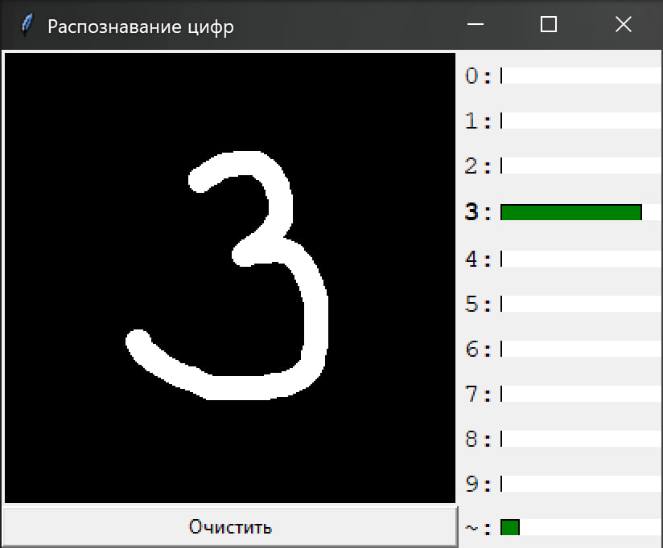

# Number Predictor

A simple Python project with a graphical interface for recognizing hand-drawn digits (and non-digits). Uses a convolutional neural network (CNN) trained on the MNIST dataset + a custom "~" class.

---

## Features

- Draw digits on a canvas (280x280 scale)
- Real-time prediction updates
- 11 classes: digits 0–9 + "not a digit" (`~`)
- Probability display as histograms
- Support for clearing and erasing

---

## Project Structure

```
Project_Number_predictor/
├── model/
│ ├── train_model.py # model training
│ ├── dataset.py # dataset processing
│ ├── not_digit.py # forming the "NOT a digit" class
│ └── mnist_cnn.pth # model weights
├── app/
│ ├── draw_app.py # GUI drawing app
│ └── predictor.py # image prediction function
├── training/
├── testing/
└── requirements.txt
```


---

## 🚀 Launch

- To run from source — use the command  `python app/draw_app.py`
- To run without Python — use the built executable file `number_predictor.exe`

---

## Training

The model is a convolutional neural network:
- 2 convolutional layers: `Conv2D + ReLU + MaxPool`
- 2 fully connected layers
- Classification into 11 outputs (`0-9` + `not a digit`)

Trained on a PNG dataset extended from MNIST:
- Image size: 28x28
- Grayscale
- Manually supplemented with the `~` class

---

## Author

- GitHub: [van4956](https://github.com/van4956)
- Telegram: [van4956](https://t.me/van4956)

---

## GUI

